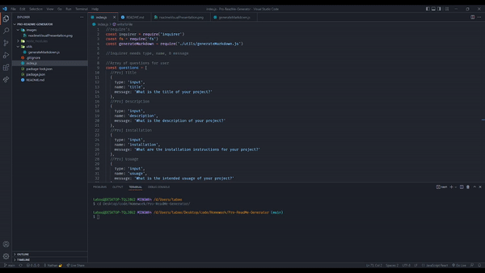

# Pro ReadMe Generator

  

  ***
  ## Table of Contents
  - [Description](#description)
  - [Visual Presentation](#visual-presentation)
  - [Technologies Used](#technologies-used)
  - [Installation](#installation)
  - [Usage](#usage)
  - [Contribution](#contribution)
  - [Testing](#testing)
  - [Additional Info](#additional-info)

  
  ***
  ## Description
  Create professional level Readme.md files quickly and effortlessly!
  
  ***
  ## Technologies Used
  Node and Inquirer.

  ***
  ## Visual Presentation
  

  ***
  ## Technologies Used
  Sample Text

  ***
  ## Installation
  To install, download the files from github and install inquirer. Then simply run the index.js.

  ***
  ## Usuage
  To generate professional level Readme.md files quickly.

  ***
  ## Contribution
  N/A

  ***
  ## Testing
  N/A

  ***
  ## Additional Info
  - Github: TabuHana(https://github.com/TabuHana)
  - Email: nate31196@outlook.com
